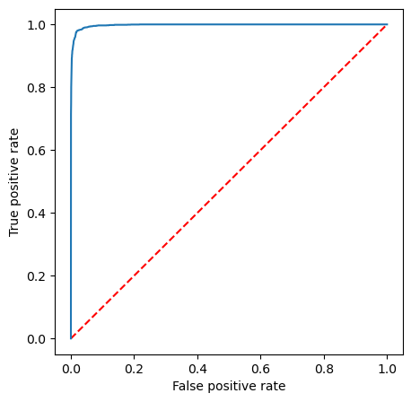

# Dessert or Not?
A PySpark data preparation and logistic regression pipeline for working out which attributes of an Epicurious recipe are important in determining whether or not it is a dessert (without looking at the name of the dish!)

Uses the [Epicurious - Recipes with Rating and Nutrition](https://www.kaggle.com/datasets/hugodarwood/epirecipes) Kaggle dataset, originally scraped from http://www.epicurious.com/recipes-menus.

### About the data

The dataset consists of over 20,000 recipes. Each row holds the following:
- the recipe name
- the site rating (out of 5)
- calories (kcal)
- protein (g)
- fat (g)
- sodium (mg)
- a set of binary attributes, for example the presence of a hashtag (e.g `#cakeweek`) an ingredient (e.g. `almond`) or a cooking technique (e.g. `bake`)

There's a class imbalance of about 4:1 between non-desserts and desserts, but since this isn't severe, we don't take any particular steps to address it.

### Data cleaning and feature engineering steps taken:

#### Data cleaning

- Many columns contain undesirable characters such as # (from hashtags), and invalid characters. We standardise these by keeping only letters, numbers and underscores.

- `#cakeweek` and `#wasteless` columns contained three rows with non-binary entries. Since this number is small compared to the dataset size, we drop these rows.

- 5 rows contained only null values, which were also removed.

- 1 row contained non-numerical values in one of the continuous variable columns (in this case, containing text in the `calories` column, most likely due to column mis-alignment), which was removed.

- Values above the 99th percentile in the `calories`, `protein`, `fat`, and `sodium` columns are treated as non-sensible and are capped at the 99 percentile value.

- Remove all binary predictors which occur fewer than 10 times, since these aren't present often enough to be reliable.

#### Feature engineering

- Create ratio features (proprortions of calories made up by each macronutrient)

### Model evaluation and optimisation

#### Precision, recall and accuracy

Training and evaluating the model on the entire dataset in a 70:30 train:test split yields the following:

|           |        |
|-----------|--------|
| Precision | 91.24% |
| Recall    | 92.20% |
| Accuracy  | 99.32% |

where our accuracy measure is the area under the ROC curve:



#### Optimising the elastic net mixing parameter
We compare the performance of Lasso regression (L1 regularization) and Ridge regression (L2 regularization) by trying values of the elastic net mixing parameter of:
- `α = 0`: Pure L2 regularization (Ridge regression)
- `α = 1`: Pure L1 regularization (Lasso regression).

We perform 3-fold cross validation for each value of the parameter, finding that `α = 0`, i.e. Pure L2 regularization (Ridge regression) gives us the largest areaUnderROC (accuracy) by a thin margin. 

#### Explainability: which coefficients are the biggest drivers?

Terms with coefficients close to zero like `blender`, `quince` and `cinnamon` are not very predictive of whether or not a recipe is a dessert, whereas terms like `cauliflower`, `horseradish` and `coffeegrinder` are highly predictive. 

Of our macronutrient-based features, `protein_ratio` is the most influential.

### The final pipeline
The final version of this project's ML pipeline uses a `pyspark.ml` `Pipeline` consisting of the following stages to prepare the data for logistic regression:

```
food_pipeline = Pipeline(
    stages = [
        scalar_na_filler,
        extreme_value_capper_cal,
        extreme_value_capper_pro,
        extreme_value_capper_fat,
        extreme_value_capper_sod,
        imputer,
        continuous_assembler,
        continuous_scaler,
        preml_assembler,
        lr
    ]
)
```

- `ScalarNAFiller` - a custom `Transformer` for filling binary column `na` values with `0.0`. 

- `ExtremeValueCapper` - a custom estimator which caps continuous column values which are above or below a particular number of standard deviations from the mean. We define a capper for each of the `calories`, `fat`, `protein` and `sodium` columns with a 2 standard deviation boundary.

- `pyspark.ml.featureImputer` - a mean imputer applied to the calories`, `protein`, `fat`, `sodium`, `protein_ratio` and `fat_ratio` columns.

- `pyspark.ml.VectorAssembler` - creates a `continuous_features` column containing a `Vector` of continuous features.

- `pyspark.ml.MinMaxScaler` - an estimator used to scale continuous columns so that they fall between `0.0 and `1.0.

- a final `pyspark.ml.VectorAssembler` step which assembles the scaled continuous features and ratio features into a single vector column before logistic regression.

This final version of the pipeline gives an Area Under ROC accuracy of 99.32%.